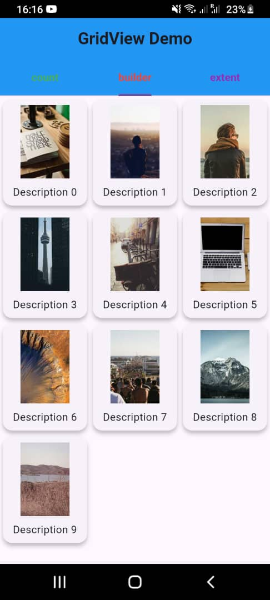

# GridView Learning

A simple project to explore and demonstrate the use of GridView in Flutter.

## Getting Started

1. **Clone the repository:**
    ```bash
    https://github.com/mangaorphy/gridview_widget.git
    cd gridview_learning
    ```
2. **Install dependencies:**
    ```
    flutter pub get
    ```
3. **Run the project:**
    ```
    flutter run
    ```
## GridView Widget has 3 Constructors
-- **GridView.count -----> Tab 1**
-- **GridView.builder -----> Tab 2**
-- **GridView.extent -----> Tab 3**

## Attribute Notes
- **GridView:** Used to display items in a grid layout.
- **Item Count:** Dynamically set based on data source.
- **CrossAxisCount:** Controls the number of columns.
- **ItemBuilder:** Efficiently builds grid items on demand.


## Screenshot showing a demo app



